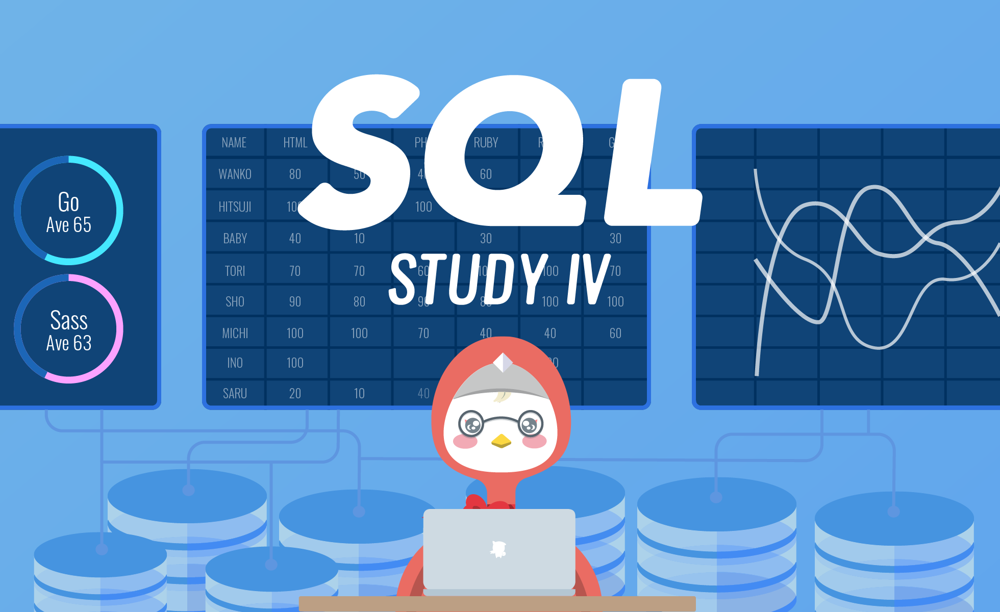

# sql_lesson_4
# SQL Study IV

Dalam pelajaran ini, kita akan mempelajari cara menambahkan, memperbarui, dan menghapus data!

### Gambaran Umum Latihan  
Menambahkan, Memperbarui, dan Menghapus Data
- INSERT
- UPDATE
- DELETE

Memantapkan Keterampilan Anda
- Mempraktikkan Hal Yang Sudah Anda Pelajari

